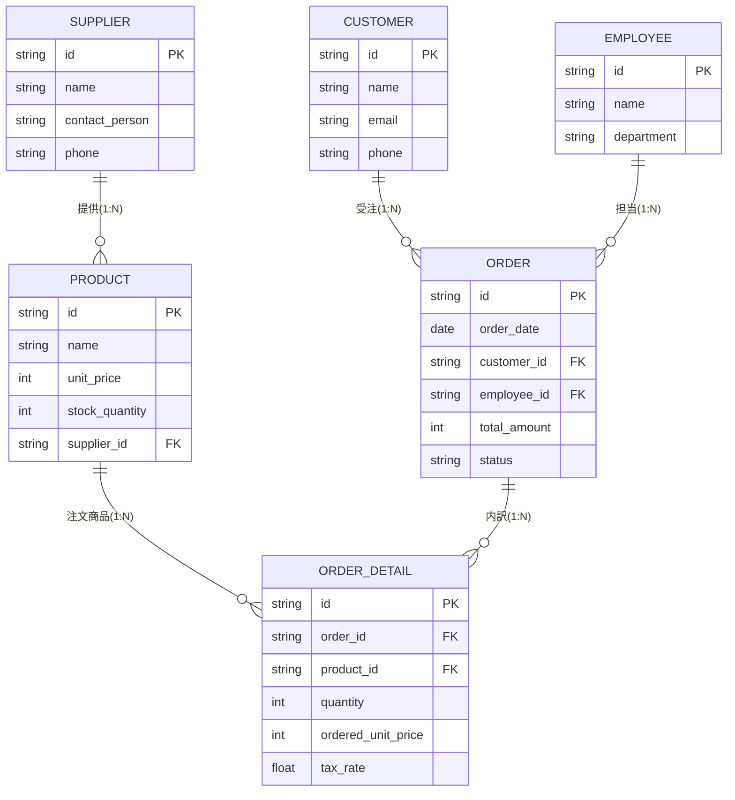

# 受注管理アプリケーション 設計仕様書

本ドキュメントは、受注管理システムにおいて必要な6つのテーブル（顧客、社員、商品、仕入れ先、受注、受注詳細）の論理設計、エンティティ関係（ER図）、およびデータ整合性を担保するためのビジネスルールを定義した仕様設計書です。

---

## 1. エンティティ関係図 (ER図)

各テーブル間のリレーションシップ（外部キー結合）とカーディナリティ（多重度）の設計です。



---

## 2. データ整合性を守るための「3大ビジネスルール」

### ① 単価履歴の保護（売上データの不変性）
*   *設計ルール*: 商品の単価（`Product.unit_price`）は改定される可能性があるため、**`ORDER_DETAIL`（受注詳細）に `ordered_unit_price`（受注時単価）を独立して保持**します。
*   *動作*: 受注確定時に、その時点の `Product.unit_price` を `ORDER_DETAIL.ordered_unit_price` にコピーします。これにより、将来商品マスターの単価が改定されても、過去の売上合計が変動するのを防ぎます。

### ② 削除整合性の担保（RESTRICT制約）
*   *設計ルール*: 顧客（`Customer`）や社員（`Employee`）の物理削除は、過去の受注データが存在する場合は禁止（`ON DELETE RESTRICT`）とします。
*   *動作*: 退会・退職の処理は、物理削除ではなく、各マスターに `is_active` フラグを設けて論理削除とし、過去の会計・実績データとの不整合を防ぎます。

### ③ アトミックな在庫引き当て
*   *設計ルール*: 受注詳細が作成された段階で、対象商品の在庫（`Product.stock_quantity`）を引き当てます。
*   *動作*: 同時購入による在庫の二重引き当て（レースコンディション）を防ぐため、在庫減算処理はトランザクションロック（またはスレッドロック）の保護下で実行されます。在庫が不足した場合は例外をスローし、受注ステータスを `PENDING` のまま差し戻します。

---

## 3. AgySheet / Pydantic モデル定義コード

以下は、本設計に基づく Python での宣言的モデル定義です。このコードを実行することで、API と UI が自動生成されます。

```python
from datetime import date
from typing import List, Optional
import agysheet as agy

# 1. 仕入れ先マスター
class Supplier(agy.Model):
    id: str = agy.Field(primary_key=True, title="仕入れ先ID")
    name: str = agy.Field(title="仕入れ先名", required=True)
    contact_person: str = agy.Field(title="担当者名")
    phone: str = agy.Field(title="電話番号")

# 2. 顧客マスター
class Customer(agy.Model):
    id: str = agy.Field(primary_key=True, title="顧客ID")
    name: str = agy.Field(title="顧客名", required=True)
    email: str = agy.Field(title="メールアドレス", validation="email")
    phone: str = agy.Field(title="電話番号")
    is_active: bool = agy.Field(default=True, title="有効顧客フラグ")

# 3. 社員マスター
class Employee(agy.Model):
    id: str = agy.Field(primary_key=True, title="社員ID")
    name: str = agy.Field(title="社員名", required=True)
    department: str = agy.Field(title="所属部署")
    is_active: bool = agy.Field(default=True, title="在籍フラグ")

# 4. 商品マスター
class Product(agy.Model):
    id: str = agy.Field(primary_key=True, title="商品ID")
    name: str = agy.Field(title="商品名", required=True)
    unit_price: int = agy.Field(title="標準単価", required=True)
    stock_quantity: int = agy.Field(default=0, title="在庫数")
    supplier_id: str = agy.Field(foreign_key="Supplier.id", title="仕入れ先")

# 5. 受注ヘッダー
class Order(agy.Model):
    id: str = agy.Field(primary_key=True, title="受注番号")
    order_date: date = agy.Field(default_factory=date.today, title="受注日")
    customer_id: str = agy.Field(foreign_key="Customer.id", title="顧客")
    employee_id: str = agy.Field(foreign_key="Employee.id", title="担当社員")
    total_amount: int = agy.Field(default=0, title="合計金額")
    status: str = agy.Field(
        default="PENDING",
        choices=["PENDING", "CONFIRMED", "CANCELLED"],
        title="受注ステータス"
    )

# 6. 受注詳細（内訳）
class OrderDetail(agy.Model):
    id: str = agy.Field(primary_key=True, title="明細ID")
    order_id: str = agy.Field(foreign_key="Order.id", title="受注番号")
    product_id: str = agy.Field(foreign_key="Product.id", title="商品")
    quantity: int = agy.Field(default=1, title="数量")
    ordered_unit_price: int = agy.Field(title="受注時単価")  # 単価履歴の保護用
    tax_rate: float = agy.Field(default=0.10, title="税率")

    # オートメーション: 注文確定時に単価を商品マスタからコピーし、受注合計を更新
    @classmethod
    def before_create(cls, detail: "OrderDetail", db_session):
        # 1. 商品マスタから単価を取得してコピー
        product = db_session.get(Product, detail.product_id)
        if not product:
            raise ValueError("Product not found")
        detail.ordered_unit_price = product.unit_price

        # 2. 在庫の引き当てと検証
        if product.stock_quantity < detail.quantity:
            raise ValueError(f"在庫不足: {product.name} (残り {product.stock_quantity} 個)")
        product.stock_quantity -= detail.quantity

    @classmethod
    def after_create(cls, detail: "OrderDetail", db_session):
        # 3. 親の受注（Order）の合計金額を再計算して更新
        order = db_session.get(Order, detail.order_id)
        if order:
            subtotal = detail.ordered_unit_price * detail.quantity * (1 + detail.tax_rate)
            order.total_amount += int(subtotal)
            order.status = "CONFIRMED"
```
