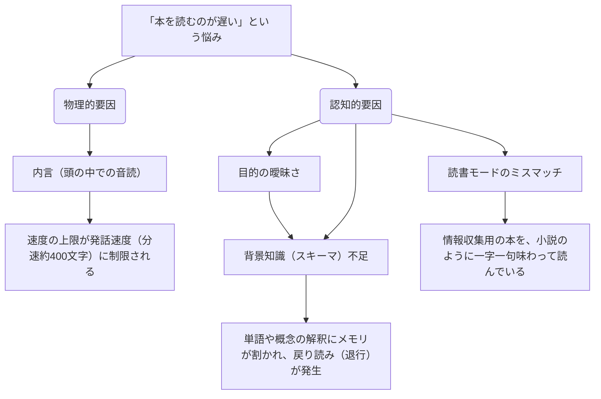

# 読書速度の課題分析と「認知OS」アップデートプラン

本ドキュメントは、ワークフロー `logic_fortress` における 4 体のエージェント（Skeptic, Causalist, Expansionist, Secretary）の論理的議論に基づき、「なぜ本を読むのが遅いのか」を脳の認知システムレベルで分析し、その解決策を提示するものです。

---

## 1. 読書が「遅い」と感じる根本原因（因果マップ）

エージェントたちの分析により、読書が遅くなる物理的・認知的な因果関係が以下のように整理されました。

---

 2. 解決策：読書モードの分離

すべての本を同じ速度・方法で読むのではなく、本の性質と読書目的に応じて「動作モード」を明示的に切り替えます。

| モード名 | 対象となる本のジャンル | 読書の目的 | 推奨される読み方 | 「遅さ」の定義 |
| :--- | :--- | :--- | :--- | :--- |
| **データベース・検索モード** | ビジネス書、実用書、技術書、ニュース、論文 | 特定の問いに対する情報抽出、学習 | 必要な箇所をクエリ実行（スキャニング＆スキップ） | **バグ（排除すべき）** |
| **ジャーニー・対話モード** | 小説、詩集、エッセイ、難解な哲学書、歴史書 | 著者の思考プロセスの追体験、感性の育成 | 一字一句をじっくり味わい、思考を巡らせる | **仕様（価値そのもの）** |
##
---

## 3. 「データベース型読書」のための3ステップ・パイプライン

情報収集としての読書速度を劇的に向上させるための、脳の処理パイプライン設計です。

---

## 4. よっちゃんが今日から実践できるアクションプラン

> [!TIP]
> 読書を始める前に、ノートの余白やPCに**「この本から今日持ち帰りたい3つの問い」**を1分で書き出してください。これだけで脳のフィルタリング機能が起動し、不要な情報（ノイズ）を自動的にスキップできるようになります。

### アクションチェックリスト
- [ ] **ステップ1：本の「モード判定」を行う**
  これから読む本が「データベース型（情報抽出）」か「ジャーニー型（追体験）」かを意識的に決める。
- [ ] **ステップ2：最初の3分間で「地図」を手に入れる**
  目次と前書き・あとがきだけを読み、本の全体構造を頭の中にマッピングする。
- [ ] **ステップ3：頭の中の「音読」を意識的に止める**
  データベース型読書の際は、文字を声に出さず、キーワードを「視覚パターン」として捉えてスキャンする。
- [ ] **ステップ4：退行（戻り読み）を禁止する**
  理解できない単語があっても立ち止まらず、一旦最後までスキャンを進めて文脈から推測する。
