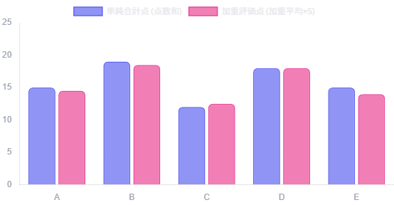
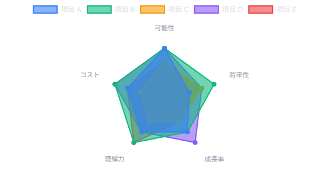
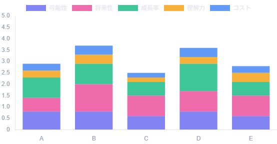
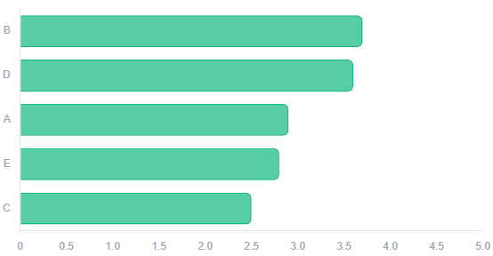
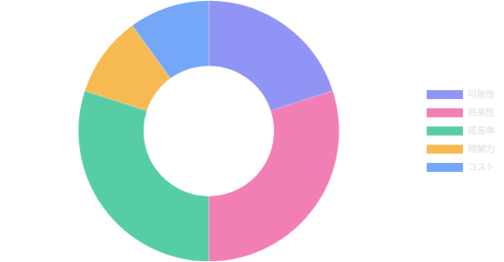
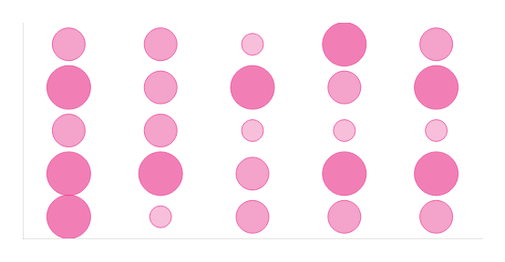

# 📊 優先順位評価: 優先順位評価

- **日付**: 2026-07-12
- **分類**: 分類 / 中区分 / 小分類
- **目的**: 目的
- **背景**: 背景
- **理由**: 理由
- **目標値**: 目標値
- **評価期間**: 期間

---

## 🏁 最終結論
**結論: 優先順位 1位は「項目 B」**  
(加重平均スコア: `3.700`)

## 💬 よっちゃんのコメント
（コメントなし）

---

### 📋 優先順位評価テーブル
| # | 評価項目名 | 可能性 (重み: 0.2) | 将来性 (重み: 0.3) | 成長率 (重み: 0.3) | 理解力 (重み: 0.1) | コスト (重み: 0.1) | 単純合計 | 加重平均 | 順位 |
|---|---|---|---|---|---|---|---|---|---|
| 1 | A | 4 | 2 | 3 | 3 | 3 | 15 | 2.900 | 3 |
| 2 | B | 4 | 4 | 3 | 4 | 4 | 19 | 3.700 | 1 |
| 3 | C | 3 | 3 | 2 | 2 | 2 | 12 | 2.500 | 5 |
| 4 | D | 4 | 3 | 4 | 3 | 4 | 18 | 3.600 | 2 |
| 5 | E | 3 | 3 | 2 | 4 | 3 | 15 | 2.800 | 4 |
| **重み** | - | **0.2** | **0.3** | **0.3** | **0.1** | **0.1** | - | - | - |

---

## 📈 意思決定分析グラフ

### 📊 総合分析
| 単純合計 vs 加重評価点 比較 | 評価項目別バランス分析（レーダー） |
|:---:|:---:|
|  |  |

### 🔍 内訳・ランキング分析
| 評価基準別のスコア貢献度内訳（積み上げ） | 加重評価スコア ランキング |
|:---:|:---:|
|  |  |

### 🍩 重要度・評価マトリクス分析
| 評価基準の重み（重要度）配分 | 評価マトリクス（基準×項目ヒートマップ） |
|:---:|:---:|
|  |  |
