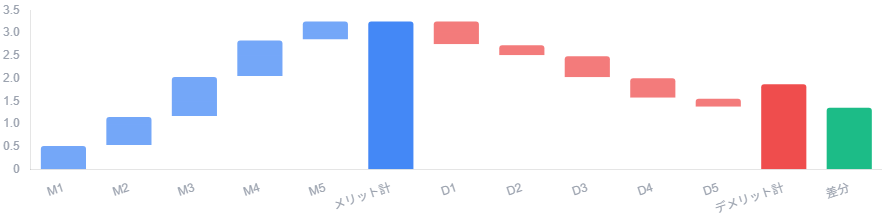
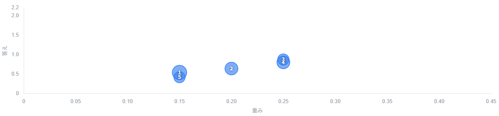
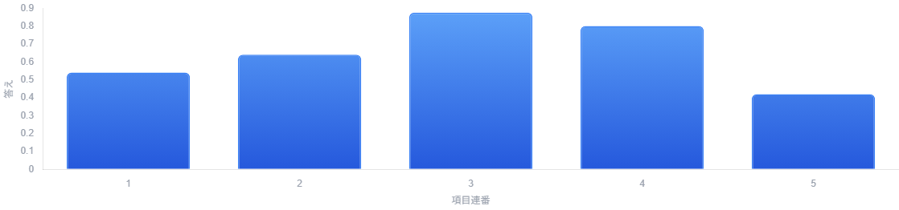
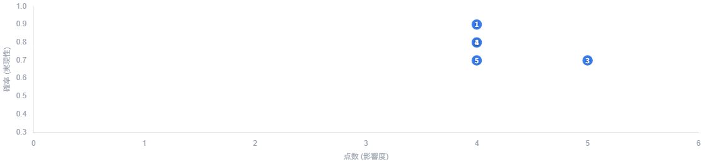
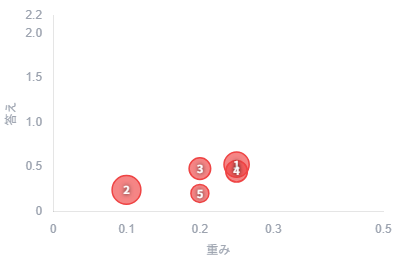
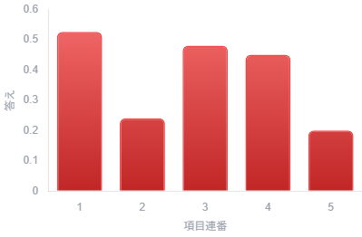
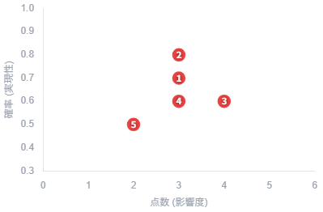

# 📊 意思決定評価: 2026-07-12_1712

- **日付**: 2026-07-12
- **分類**: 分類 / 中区分 / 小分類
- **目的**: 目的
- **背景**: 背景
- **理由**: 理由
- **目標値**: 目標値
- **評価期間**: 期間

---

## 🏁 最終結論
**結論: 実行する！！**  
(差分スコア: `1.380`)

## 💬 よっちゃんのコメント
あいうえをかきくけこ

---

### 🔵 メリット評価 (答え合計: `3.275`)
| # | 項目 | 重み | 点数 | 調整値 (重み×点数) | 確率 | 答え (調整値×確率) | 順位 |
|---|---|---|---|---|---|---|---|
| 1 | A | 0.15 | 4 | 0.60 | 0.9 | 0.540 | 4 |
| 2 | B | 0.2 | 4 | 0.80 | 0.8 | 0.640 | 3 |
| 3 | C | 0.25 | 5 | 1.25 | 0.7 | 0.875 | 1 |
| 4 | D | 0.25 | 4 | 1.00 | 0.8 | 0.800 | 2 |
| 5 | E | 0.15 | 4 | 0.60 | 0.7 | 0.420 | 5 |
| **合計** | - | **1.00** | **21** | **4.25** | **3.90** | **3.275** | - |

### 🔴 デメリット評価 (答え合計: `1.895`)
| # | 項目 | 重み | 点数 | 調整値 (重み×点数) | 確率 | 答え (調整値×確率) | 順位 |
|---|---|---|---|---|---|---|---|
| 1 | a | 0.25 | 3 | 0.75 | 0.7 | 0.525 | 1 |
| 2 | b | 0.1 | 3 | 0.30 | 0.8 | 0.240 | 4 |
| 3 | c | 0.2 | 4 | 0.80 | 0.6 | 0.480 | 2 |
| 4 | d | 0.25 | 3 | 0.75 | 0.6 | 0.450 | 3 |
| 5 | e | 0.2 | 2 | 0.40 | 0.5 | 0.200 | 5 |
| **合計** | - | **1.00** | **15** | **3.00** | **3.20** | **1.895** | - |

---

## 📈 意思決定分析グラフ

### ⚖️ 累積インパクト滝グラフ (Waterfall)

### 🔵 メリット詳細分析
| バブルグラフ (重み・答え・確率) | 立体風棒グラフ (答え) | ポテンシャル4象限 (点数・確率) |
|:---:|:---:|:---:|
|  |  |  |

### 🔴 デメリット詳細分析
| バブルグラフ (重み・答え・確率) | 立体風棒グラフ (答え) | ポテンシャル4象限 (点数・確率) |
|:---:|:---:|:---:|
|  |  |  |
