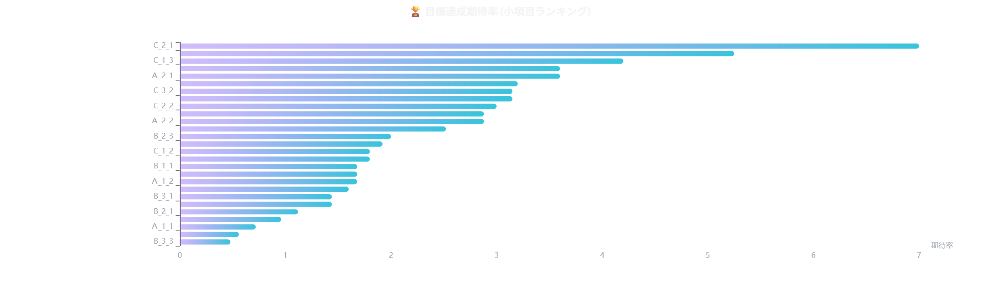
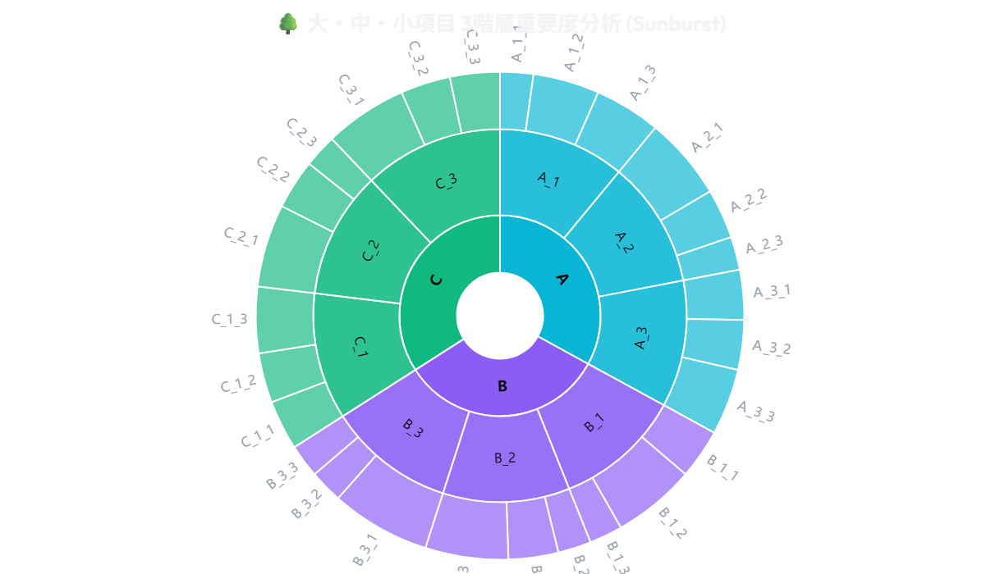
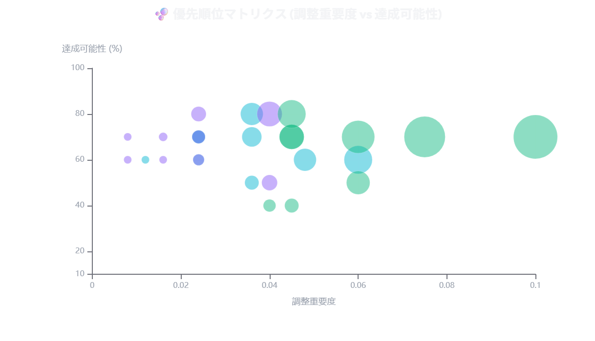
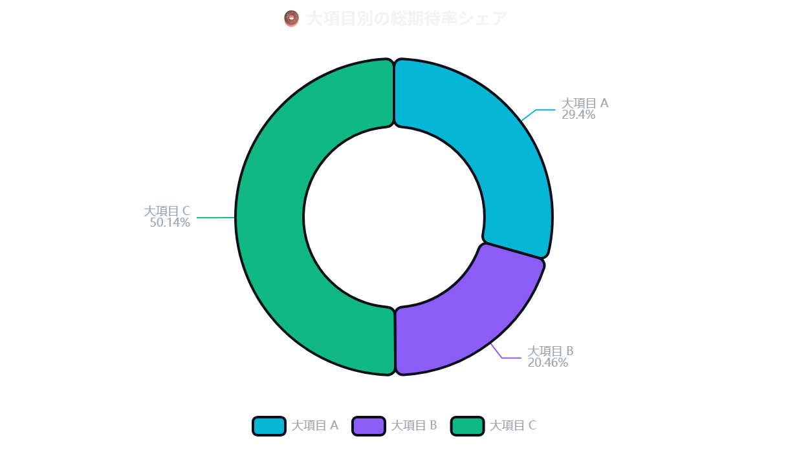
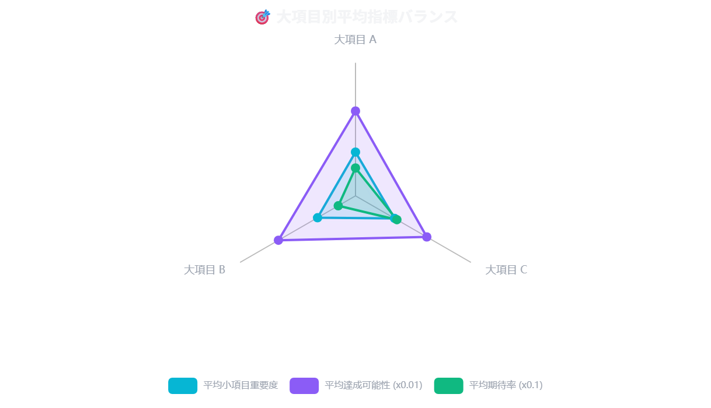

# 🎯 目標達成法 評価レポート (2026-07-13 14:04)

## 📋 基本設定
| 項目      | 設定値        |
| :------ | :--------- |
| **分類**  |            |
| **中区分** |            |
| **小分類** |            |
| **月日**  |            |
| **目標値** |            |
| **目的**  |            |
| **背景**  |            |
| **理由**  |            |
| **期間**  | あいうえをかきくけこ |

## 🔥 今日のコミットメント（目標・宣言）
（未入力）

---

## 📊 目標達成評価テーブル

| No | 大項目 | 大項目内容 | 重要度 (C) | 中項目 | 中項目内容 | 重要度 (F) | 小項目 | 小項目内容 | 重要度 (I) | 調整済み重要度 (M) | 達成可能性 (N) | 目標達成期待率 (O) | ランク (Q) |
| :---: | :---: | :---: | :---: | :---: | :---: | :---: | :---: | :--- | :---: | :---: | :---: | :---: | :---: |
| 1 | A |  | 0.3 | A_1 |  | 0.2 | A_1_1 | Ａ_1_1 | 0.2 | 0.012 | 60% | 0.72 | 25 |
| 2 | A |  | 0.3 | A_1 |  | 0.2 | A_1_2 | Ａ_1_2 | 0.4 | 0.024 | 70% | 1.68 | 17 |
| 3 | A |  | 0.3 | A_1 |  | 0.2 | A_1_3 | Ａ_1_3 | 0.4 | 0.024 | 70% | 1.68 | 17 |
| 4 | A |  | 0.3 | A_2 |  | 0.4 | A_2_1 | Ａ_2_1 | 0.5 | 0.060 | 60% | 3.60 | 4 |
| 5 | A |  | 0.3 | A_2 |  | 0.4 | A_2_2 | Ａ_2_2 | 0.3 | 0.036 | 80% | 2.88 | 10 |
| 6 | A |  | 0.3 | A_2 |  | 0.4 | A_2_3 | Ａ_2_3 | 0.2 | 0.024 | 60% | 1.44 | 21 |
| 7 | A |  | 0.3 | A_3 |  | 0.4 | A_3_1 | Ａ_3_1 | 0.3 | 0.036 | 50% | 1.80 | 15 |
| 8 | A |  | 0.3 | A_3 |  | 0.4 | A_3_2 | Ａ_3_2 | 0.3 | 0.036 | 70% | 2.52 | 12 |
| 9 | A |  | 0.3 | A_3 |  | 0.4 | A_3_3 | Ａ_3_3 | 0.4 | 0.048 | 60% | 2.88 | 10 |
| 10 | B |  | 0.2 | B_1 |  | 0.4 | B_1_1 | B_1_1 | 0.3 | 0.024 | 70% | 1.68 | 17 |
| 11 | B |  | 0.2 | B_1 |  | 0.4 | B_1_2 | B_1_2 | 0.5 | 0.040 | 80% | 3.20 | 6 |
| 12 | B |  | 0.2 | B_1 |  | 0.4 | B_1_3 | B_1_3 | 0.2 | 0.016 | 60% | 0.96 | 24 |
| 13 | B |  | 0.2 | B_2 |  | 0.4 | B_2_1 | B_2_1 | 0.2 | 0.016 | 70% | 1.12 | 23 |
| 14 | B |  | 0.2 | B_2 |  | 0.4 | B_2_2 | B_2_2 | 0.3 | 0.024 | 80% | 1.92 | 14 |
| 15 | B |  | 0.2 | B_2 |  | 0.4 | B_2_3 | B_2_3 | 0.5 | 0.040 | 50% | 2.00 | 13 |
| 16 | B |  | 0.2 | B_3 |  | 0.2 | B_3_1 | B_3_1 | 0.6 | 0.024 | 60% | 1.44 | 21 |
| 17 | B |  | 0.2 | B_3 |  | 0.2 | B_3_2 | B_3_2 | 0.2 | 0.008 | 70% | 0.56 | 26 |
| 18 | B |  | 0.2 | B_3 |  | 0.2 | B_3_3 | B_3_3 | 0.2 | 0.008 | 60% | 0.48 | 27 |
| 19 | C |  | 0.5 | C_1 |  | 0.3 | C_1_1 | C_1_1 | 0.3 | 0.045 | 70% | 3.15 | 7 |
| 20 | C |  | 0.5 | C_1 |  | 0.3 | C_1_2 | C_1_2 | 0.3 | 0.045 | 40% | 1.80 | 15 |
| 21 | C |  | 0.5 | C_1 |  | 0.3 | C_1_3 | C_1_3 | 0.4 | 0.060 | 70% | 4.20 | 3 |
| 22 | C |  | 0.5 | C_2 |  | 0.4 | C_2_1 | C_2_1 | 0.5 | 0.100 | 70% | 7.00 | 1 |
| 23 | C |  | 0.5 | C_2 |  | 0.4 | C_2_2 | C_2_2 | 0.3 | 0.060 | 50% | 3.00 | 9 |
| 24 | C |  | 0.5 | C_2 |  | 0.4 | C_2_3 | C_2_3 | 0.2 | 0.040 | 40% | 1.60 | 20 |
| 25 | C |  | 0.5 | C_3 |  | 0.3 | C_3_1 | C_3_1 | 0.5 | 0.075 | 70% | 5.25 | 2 |
| 26 | C |  | 0.5 | C_3 |  | 0.3 | C_3_2 | C_3_2 | 0.3 | 0.045 | 70% | 3.15 | 7 |
| 27 | C |  | 0.5 | C_3 |  | 0.3 | C_3_3 | C_3_3 | 0.3 | 0.045 | 80% | 3.60 | 4 |

---

## 📈 パフォーマンス・分析グラフ

### 🏆 期待率ランキング

### 📊 カテゴリ ＆ マトリクス分析
| 🌳 3階層重要度分析 (Sunburst) | 🫧 優先順位マトリクス (Bubble) |
| :---: | :---: |
|  |  |

### 🍩 シェア ＆ バランス分析
| 🍩 大項目別期待率シェア | 🎯 大項目別平均バランス |
| :---: | :---: |
|  |  |
