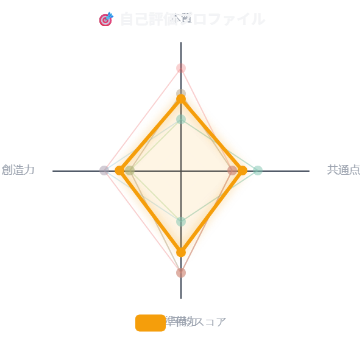
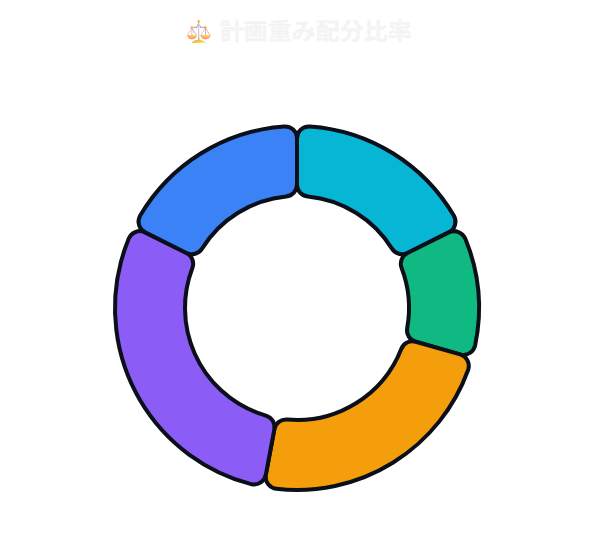
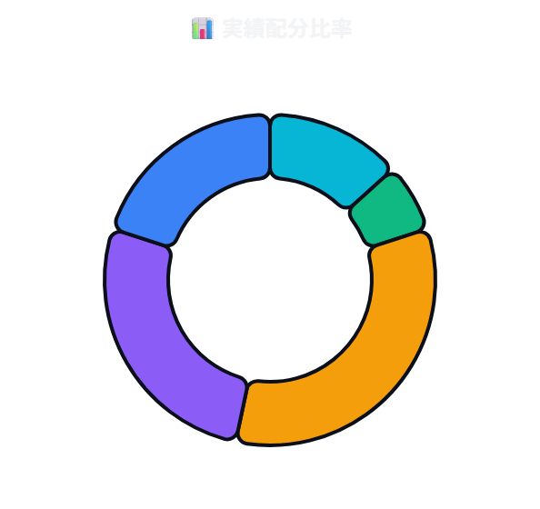
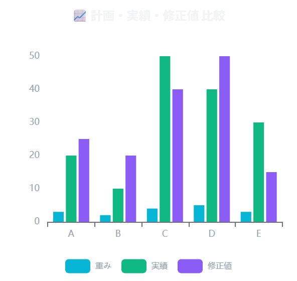
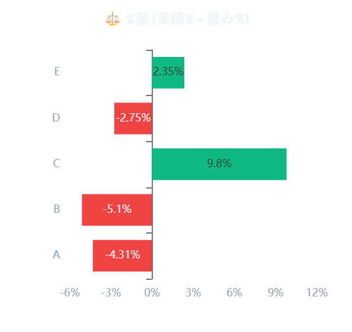
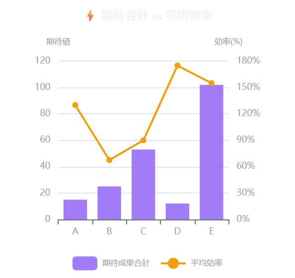
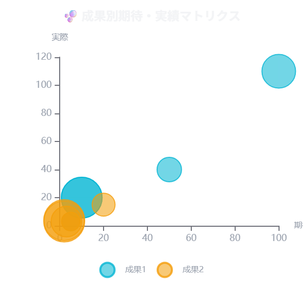
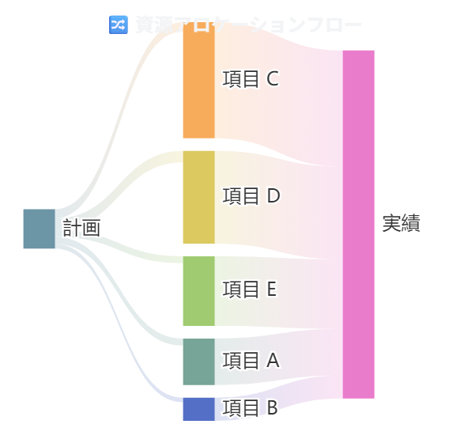

# 📊 資源配分 & 自己成長フィードバック (2026-07-13)

## 🔥 今日のコミットメント（目標・宣言）
あいうえお、書きこけこ

---

## ⚖️ 資源アロケーション (計画 vs 実績)

| 項目 | 重み | 重み% | 配分実績 | 実績% | %差 | 修正値 | 修正値% |
| :---: | :---: | :---: | :---: | :---: | :---: | :---: | :---: |
| A | 3 | 17.6% | 20 | 13.3% | -4.3% | 25 | 16.7% |
| B | 2 | 11.8% | 10 | 6.7% | -5.1% | 20 | 13.3% |
| C | 4 | 23.5% | 50 | 33.3% | +9.8% | 40 | 26.7% |
| D | 5 | 29.4% | 40 | 26.7% | -2.7% | 50 | 33.3% |
| E | 3 | 17.6% | 30 | 20.0% | +2.4% | 15 | 10.0% |
| **合計** | **17** | **100.0%** | **150** | **100.0%** | **0.0%** | **150** | **100.0%** |

---

## 📝 事後分析・自己評価

| 項目 | 期待成果_1 | 実際成果_1 | 単位_1 | 効率_1 | 期待成果_2 | 実際成果_2 | 単位_2 | 効率_2 | 本質 | 創造力 | 準備力 | 共通点 |
| :---: | :---: | :---: | :---: | :---: | :---: | :---: | :---: | :---: | :---: | :---: | :---: | :---: |
| A | 10 | 20 | ページ/時間 | 200.0% | 5 | 3 | ％　確率 | 60.0% | 3 | 2 | 4 | 2 |
| B | 5 | 3 | ％　確率 | 60.0% | 20 | 15 | ％　確率 | 75.0% | 2 | 2 | 2 | 3 |
| C | 50 | 40 | 件数 | 80.0% | 3 | 3 | ％　確率 | 100.0% | 3 | 2 | 4 | 2 |
| D | 10 | 20 | 件数 | 200.0% | 2 | 3 | ％　確率 | 150.0% | 4 | 3 | 4 | 2 |
| E | 100 | 110 | ％　確率 | 110.0% | 2 | 4 | ％　確率 | 200.0% | 2 | 3 | 2 | 3 |

---

## 📈 パフォーマンス・分析グラフ

| 🎯 自己評価プロファイル | ⚖️ 計画重み配分比率 |
| :---: | :---: |
|  |  |

| 📊 実績配分比率 | 📈 計画・実績・修正値 比較 |
| :---: | :---: |
|  |  |

| ⚖️ %差 (実績% - 重み%) | ⚡ 期待合計 vs 平均効率 |
| :---: | :---: |
|  |  |

| 🫧 期待・実績マトリクス | 🔀 資源アロケーションフロー |
| :---: | :---: |
|  |  |
